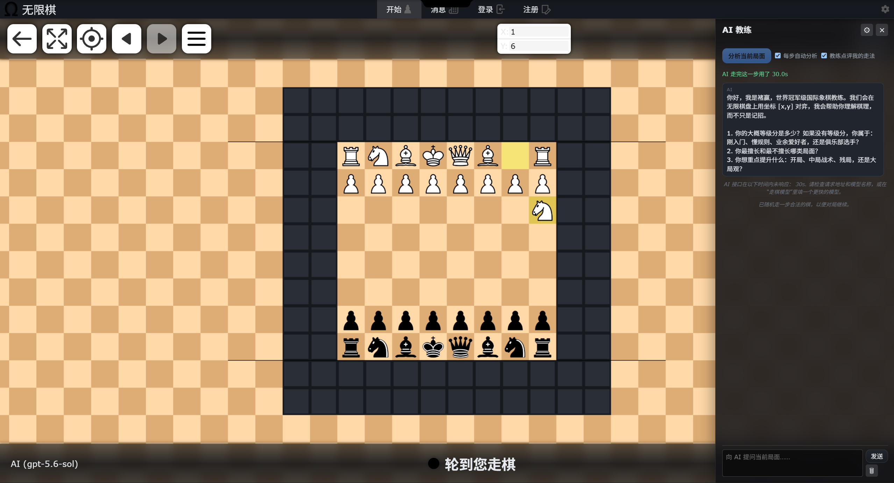
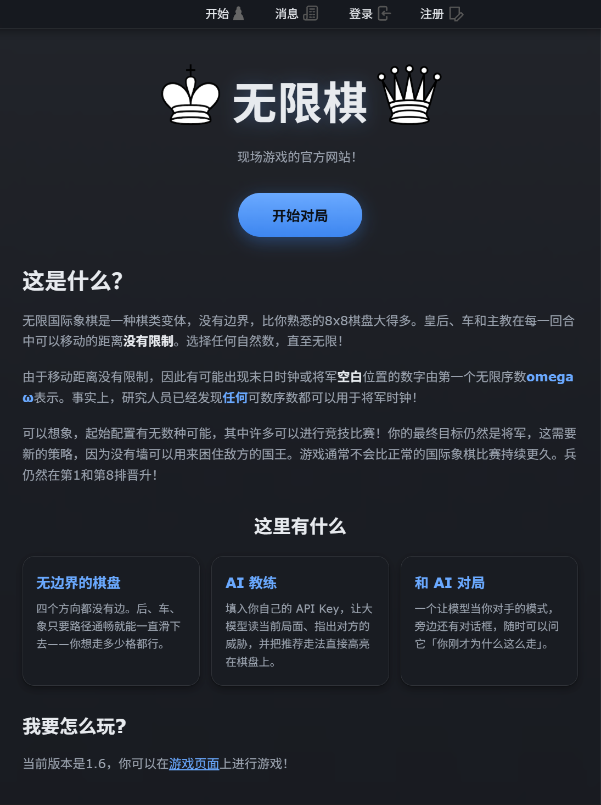
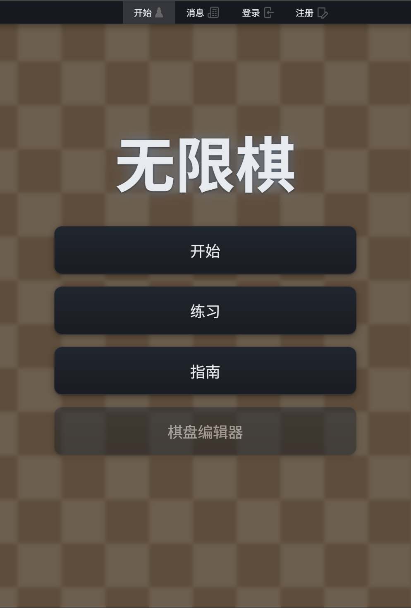
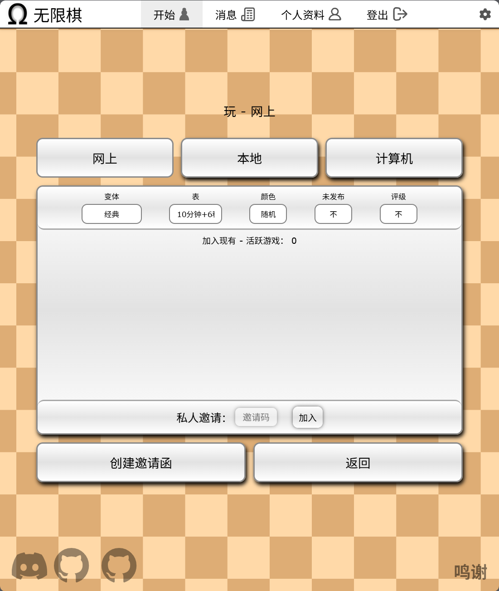
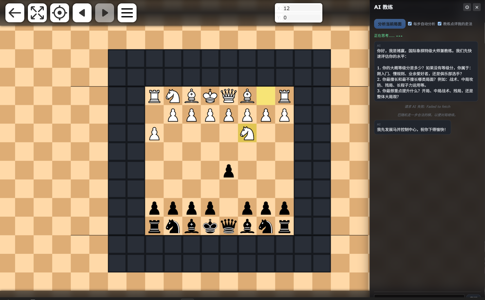

# CHUWIN · 无限棋

一个面向 Windows 的无限棋盘网页服务器。项目基于 [Infinite Chess](https://github.com/Infinite-Chess/infinitechess.org) 开源代码，并补充了中文界面、中文文档、Windows 一键启动脚本以及 AI 教练功能。



## 项目简介

CHUWIN 将传统国际象棋放到一个没有边界的二维棋盘上：棋子可以继续向棋盘外探索，玩家也可以在同一套规则基础上体验不同棋类变体。服务端使用 Node.js、Express、WebSocket 和 SQLite，前端使用原生 JavaScript/TypeScript、EJS 与 WebGL 渲染。

## 主要特点

- **无限的棋盘空间**：棋盘没有固定边界，可拖拽、缩放并在任意坐标继续落子。
- **多种棋类玩法**：包含标准国际象棋及多种 fairy chess（非标准棋子）变体，棋子和棋盘主题可扩展。
- **实时对局**：基于 WebSocket 的在线对局、观战、邀请、断线重连和对局记录能力。
- **AI 教练与 AI 对手**：在对局面板中分析当前局面、给出走法建议、复盘和聊天式讲解，也可以让 AI 代替对手走棋。
- **第三方 AI API 接入**：AI 教练支持 `OpenAI-compatible` 和 `Anthropic` 两种协议，可填写自定义 API 地址、模型、温度、最大输出长度和推理强度，适配云端或自建中转服务。
- **多语言与中文本地化**：内置英语、简体中文、繁体中文、西班牙语、法语、波兰语和葡萄牙语翻译资源。
- **账号与数据持久化**：SQLite 保存账号、会话、对局和统计信息；支持邮箱验证和安全的访问令牌机制。
- **HTTPS 开发环境**：首次启动会自动准备本地开发证书，可直接通过 `https://localhost:3443` 访问。
- **可部署性**：支持 Windows 本地运行，也提供 Dockerfile、Docker Run 和 Compose 示例。

## 快速上手（Windows）

### 最简单的方式：双击启动

1. 安装 [Node.js](https://nodejs.org/)（建议使用 20 LTS 或更高版本）。
2. 双击项目根目录的 **`启动.bat`**。
3. 首次运行前如果项目还没有 `node_modules`，先在项目目录执行一次 `npm install`；之后即可直接双击启动。
4. 脚本会运行 `npm run watch`，自动构建并在代码变化时重新构建，同时等待 HTTPS 服务就绪后打开浏览器。
5. 浏览器访问 **<https://localhost:3443/>**。浏览器提示本地证书不受信任时，在本机开发环境中选择继续访问即可。

### 命令行方式

```powershell
cd "E:\\youxi\\xiangqi\\infinitechess-2025.05.12"
npm install
npm run build
npm start
```

启动成功时终端会显示：

```text
HTTP listening on port 3000
HTTPS listening on port 3443
```

开发期间也可以使用：

```powershell
npm run watch
```

首次启动时，`src/server/config/env.js` 会在根目录生成 `.env`（如果文件不存在），并创建随机的访问令牌密钥。`.env`、证书、数据库、日志、`dist` 和 `node_modules` 已加入 `.gitignore`，请不要把真实密钥提交到仓库。

## AI 教练配置

启动后进入对局页面，打开右侧 **AI 教练** 面板，在设置中填写：

| 配置项 | 说明 |
| --- | --- |
| Protocol | `openai` 或 `anthropic` |
| API URL | 服务商的基础地址或完整接口地址，程序会补齐 `/chat/completions` 或 `/messages` |
| API key | 对应服务商的密钥 |
| Model | 模型名称，例如服务商提供的聊天模型 |
| Move model | 可选，专门用于生成走法的模型 |

面板支持分析当前局面、自动点评、聊天提问和 AI 对手。API 密钥由浏览器配置并随请求发送给服务器代理，不会写入项目文件；使用第三方服务时仍应遵守服务商的计费、隐私和使用政策，建议使用权限受限的专用密钥。

服务端还提供以下 AI 路由：

- `POST /api/ai-coach`：提交局面分析或聊天请求。
- `GET /api/ai-coach/persona`：读取根目录的 `tsc.md` 作为教练人格/提示词（可选）。

## 环境变量

`.env` 中常用配置如下（开发环境默认端口已经适合 Windows 本地运行）：

```dotenv
NODE_ENV=development
HTTPPORT_LOCAL=3000
HTTPSPORT_LOCAL=3443
EMAIL_USERNAME=
EMAIL_APP_PASSWORD=
GITHUB_API_KEY=
GITHUB_REPO=Infinite-Chess/infinitechess.org
```

生产环境请设置 `NODE_ENV=production`、`HTTPPORT`、`HTTPSPORT` 和正式证书路径 `CERT_PATH`，并为 `ACCESS_TOKEN_SECRET`、`REFRESH_TOKEN_SECRET` 使用随机长密钥。若不需要 GitHub 贡献者列表，可以留空 `GITHUB_API_KEY`。

## 项目目录

| 路径 | 用途 |
| --- | --- |
| `src/client/` | 前端页面、棋盘渲染、游戏规则、UI、主题和浏览器端资源 |
| `src/server/` | Express/HTTPS 服务、WebSocket、账号认证、API、数据库和对局管理 |
| `src/server/game/` | 棋局、走子、邀请、计时器、断线和统计逻辑 |
| `src/server/api/` | AI 教练、GitHub 贡献者、偏好设置等外部/内部 API |
| `translation/` | 多语言 TOML 翻译文件和新闻内容 |
| `dev-utils/` | 棋子 SVG、音频、图片和开发辅助脚本 |
| `yinpin/` | 中文化界面使用的音频素材 |
| `图片/` | 项目截图和展示图片 |
| `docs/` | 原项目开发、导航、部署和翻译指南 |
| `build.js` | 将 `src` 构建到 `dist` 并执行 TypeScript、打包和压缩 |
| `启动.bat` | Windows 一键停止旧进程并启动开发监听 |
| `package.json` | npm 脚本和依赖定义 |
| `database.db`、`.env`、`dist/` | 本地运行生成内容，默认不会提交 |

## Docker 部署

项目自带 `Dockerfile`。构建镜像：

```bash
docker build -t chuwin:latest .
```

容器默认使用 HTTPS 端口 1443，可映射到宿主机端口：

```bash
docker run -d --name chuwin --restart always \\
  -p 3000:1443 \\
  -v "$(pwd)/database.db:/app/database.db" \\
  chuwin:latest
```

生产部署时请持久化 `database.db`，并通过环境变量或安全的密钥管理方式注入配置。不要把数据库、证书或 `.env` 文件上传到公开仓库。

## 开发与贡献

本项目遵循 AGPL 授权协议。原项目来源：[Infinite-Chess/infinitechess.org](https://github.com/Infinite-Chess/infinitechess.org)。

- 开发环境与构建细节：[`docs/SETUP.md`](docs/SETUP.md)
- 项目导航：[`docs/NAVIGATING.md`](docs/NAVIGATING.md)
- 翻译指南：[`docs/TRANSLATIONS.md`](docs/TRANSLATIONS.md)
- 授权说明：[`docs/COPYING.md`](docs/COPYING.md)
- 本项目修改记录：[`修改说明.md`](修改说明.md)
- 汉化说明：[`翻译说明.md`](翻译说明.md)

欢迎提交 Issue、改进翻译、完善棋类变体或贡献新的前端/服务端功能。提交代码前请先运行 `npm run build`，确认构建可以通过。

## 截图

| 首页 | 选择棋类 |
| --- | --- |
|  |  |

| 对局 | 演示 |
| --- | --- |
|  |  |
